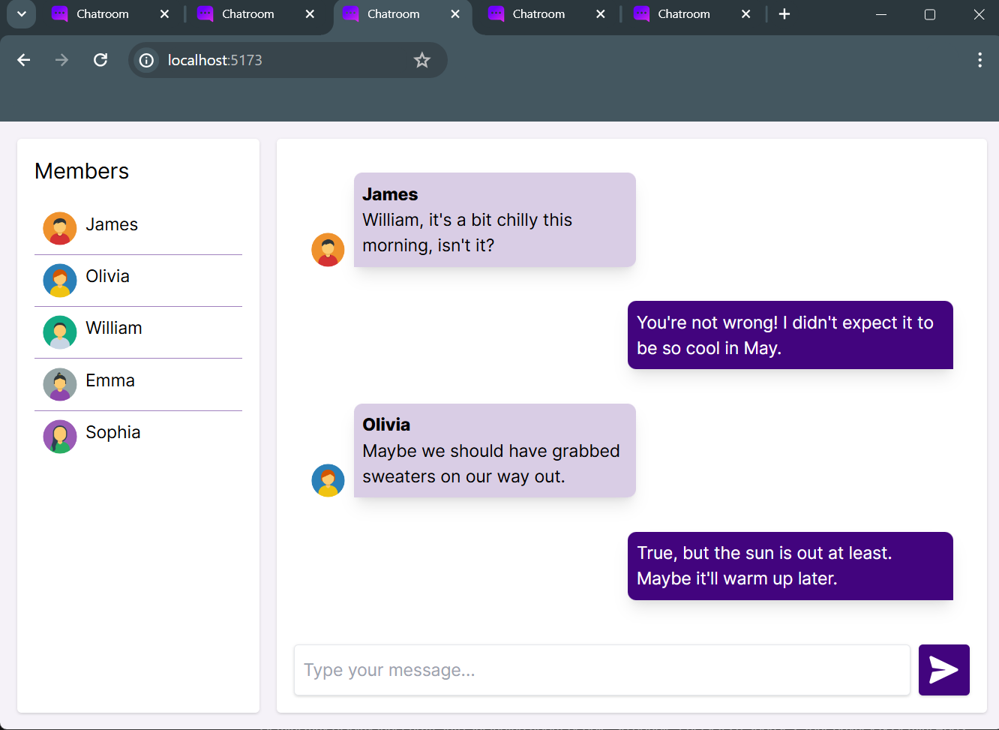

# Real-Time Chat App

This is a real-time chat application built using React, Socket.IO, and Tailwind CSS.

## Features

- **Real-Time Communication**: Users can send and receive messages in real-time without refreshing the page.
- **User Authentication**: Users can set their username and choose an avatar upon joining the chat.
- **Member List**: Displays a list of current members in the chat room.

## Technologies Used

- **React**: Used for building the front-end user interface and managing state.
- **Socket.IO**: Facilitates real-time bidirectional communication between clients and the server.
- **Tailwind CSS**: Provides utility classes for styling the UI quickly and efficiently.

## Screenshot



## Installation

1. Clone the repository:

  ```bash
   git clone https://github.com/abolfazlbzgh/real-time-chat-app.git
   ```

2. Clone the repository:
 ```bash
   cd real-time-chat-app
   ```

3. Install dependencies:
 ```bash
   npm install
   ```

4. Start the development server:
 ```bash
   nodemon backend/server
   ```
5. Start the development server:
 ```bash
   nodemon backend/server
   ```

6. Open a new terminal and navigate to the project

7. Start React App:
 ```bash
   npm run dev
   ```

8. Open your browser and visit http://localhost:5173 to view the application.

## Usage

- Upon opening the application, users are prompted to set their username and choose an avatar.
- After joining the chat, users can send messages in real-time, view other members in the chat room, and toggle between dark and light themes.

## License

This project is licensed under the MIT License. See the [LICENSE](./LICENSE.txt) file for details.
